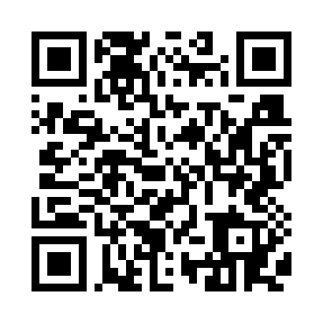

# Preparación de Matematicas

  

En este curso tomaremos recursos interactivos y también ejercicios por contenidos de los diferentes bloques de la prueba PAES M1. Esta prueba evalúa habilidades referida a las bases curriculares que son:

A. Resolver problemas
  - Resolver operatoria y procedimientos básicos
  - Utilizar estrategias para soluciones
  - Evaluar validez de resultados
    
B. Modelar
  - Usar modelos Matemáticos
  - Poder interpretar soluciones de modelos
  - Ajustar modelos a soluciones
  - Evaluar modelos según solución
    
C. Representar
  - Poder traducir de lenguaje natural a Matemático
  - Interpretar representaciones de situaciones
  - Poder transferir situaciones a distintos sistemas
    
D. Argumentar
  - Evaluar validez de argumentos propuestos
  - Identificar errores en procedimientos matemáticos
  - Evaluar validez de deducciones

Para lo cual la prueba mide conocimientos de 7° Básico a 2° Medio con los siguientes ejes temáticos:

1. Números
  - Operaciones de conjuntos enteros y racionales. Resolviendo problemas
  - Concepto y cálculo de porcentajes
  - Propiedades y desarrollo de potencias y raíces
    
2. Álgebra y Funciones
  - Productos notables y factorización algebraica
  - Operatoria y problemas de expresiones
  - Concepto y problemas de proporciones directas e inversas
  - Soluciones y problemas de ecuaciones e inecuaciones lineales
  - Solución y problemas de sistemas de ecuaciones 2x2
  - Concepto de gráficos y problema de funciones lineales y afín
  - funciones cuadráticas, problemas, gráficos y puntos especiales
    
3. Geometría
  - Pitágoras, perímetros, áreas y problemas en triángulos, paralelogramos, trapecios
  y círculos
  - Áreas, volúmenes y problemas de prismas rectos
  - Transformaciones isométricas
    
4. Probabilidades
  - Tablas, gráficos y problemas
  - Medidas y problemas de medidas de grupos de datos
  - Cuartiles y percentiles, diagrama cajón, problemas
  - Probabilidades y reglas aditivas y multiplicativas
